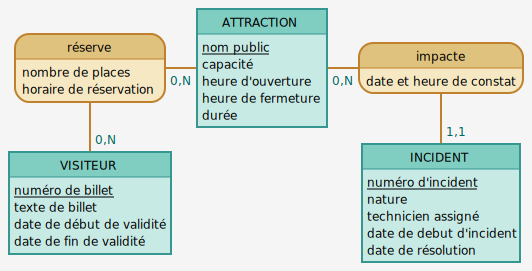

# Theme parc - Management app two in one

This project is about a fictional Theme Parc.  
It is made up of two applications:

- **Maintenance web app**: a maintenance web app that allows to open, edit, and close incidents on attractions
- **Reservation API**: An API to handle reservation for attractions slots, according to incidents/closed attraction, and remaining tickets available

------------------------

## Conception

**MCD** from [Mocodo](http://mocodo.wingi.net/)

```cmd
réserve, 0N ATTRACTION, 0N VISITEUR: nombre de places, horaire de réservation
ATTRACTION: nom public, capacité, heure d'ouverture, heure de fermeture, durée
impacte, 11 INCIDENT, 0N ATTRACTION : date et heure de constat

VISITEUR: numéro de billet, texte de billet, date de début de validité, date de fin de validité
:
INCIDENT: numéro d'incident, nature, technicien assigné, date de debut d'incident, date de résolution

```



### DB migrations management

To initialize, and migrate the database, we use **[Sqitch](https://sqitch.org/)** (version control management for databases)

## Maintenance web app

The maintenance side of the Theme Parc project is a simple **monolithic application** using a **NodeJS** / **Express** server, and **[PUG](https://pugjs.org/)** as view engine.

### Endpoints for maintenance

| Endpoint | HTTP verb | API |
|---|---|---|
| `/` | GET  | Get homepage with a list of all incidents (opened / closed) |
| `/incident/new` | GET | Get the page with a form to open a new incident |
| `/incident/new` | POST | Open a new incident with data from the form |
| `/incident/:id` | GET | Get the detail of one incident |
| `/incident/:id/edit` | GET | Get the page with a form to edit (and eventually close or re-open) an incident |
| `/incident/:id:/edit` | POST | Edit an incident (and eventually close or re-open it) |

## Reservation API app

The reservation side of the Theme Parc project is an API (no front).  
Its purpose is to allow visitors who have a valid ticket to book until four places for events.

The **SQL** for this application is quite advanced and tricky. We had to set up **views**, add **constraints**, manipulate **timestamp**, and write **SQL functions** to calculate event slots regarding opening time of events, opened incidents on events, remaining number of available places of an event slot...

### Endpoints for reservation

| Endpoint | HTTP verb | API |
|---|---|---|
| `/api/events` | GET  | Get all opened events (attractions / shows), that means all events without opened incident |
| `/api/:ticket/init` | GET | Get one ticket by its name |
| `/api/:id/bookings` | GET | Get all the booked events to come for a visitor, by ticket ID |
| `/api/:ticket/book` | POST | Books an event for a visitor, for the next available slot. A visitor can book until 3 events, and he can book until 4 places for the event. The given slot is the next event slot which has enough free places regarding the number of places asked by the visitor.  <br>Once the booked event date is over, the booking remains in the database, but is not taken into account in the 3 possible bookings of the visitor. |

### SQL: Views & functions

To handle the complexe booking feature of this API, we had to set up advanced **views** and **SQL functions**.

For example, this code (`migrations > deploy > opened_attractions_view.sql`) creates a **view** using a **SQL function** to add a boolean column to the `attraction` table which is `true` if the attraction is open, `false` if it is closed.

```sql
-- Deploy oparc:opened_attractions_view to pg
BEGIN;

    -- Est-ce que l'attraction est en mainteance ?
    -- paramètres : le timestamp, et l'id de l'attraction
   CREATE FUNCTION isItNotUnderMaintenance(timestamptz, int) RETURNS boolean AS $$
SELECT CASE
    --Regarde si un incident non cloturé existe sur l'id
	    WHEN NOT EXISTS (SELECT end_date FROM incident
      WHERE
        attraction_id = $2
        AND start_date < $1
    ) THEN TRUE --sinon retourne faux
	
    WHEN (SELECT end_date FROM incident
      WHERE
        attraction_id = $2
        AND start_date < $1
    ) IS NULL THEN FALSE --sinon retourne faux
    ELSE TRUE
  END FROM attraction WHERE id = $2;
$$ LANGUAGE SQL STRICT;

-- Est-ce que l'attraction est ouverte ?
-- 2 paramètres :  le timestamp, et l'id de l'attraction
CREATE FUNCTION isItOpen(timestamptz, int) RETURNS boolean AS $$
SELECT
    CASE
        -- si dans l'intervale d'ouverture alors regarde si il y a un incident en cours ou non grâce à l'appel de la function isUnderMaint
        WHEN $1 :: timetz
BETWEEN
(
            SELECT
    open_hour
FROM
    attraction
WHERE
                id = $2
        )
AND
(
            SELECT
    close_hour
FROM
    attraction
WHERE
                id = $2
        )
THEN isItNotUnderMaintenance
($1, $2) --sinon retourne faux
        ELSE FALSE
END
FROM
    attraction
WHERE
    id = $2;

$$ LANGUAGE SQL STRICT;

CREATE VIEW opened_attraction
AS
    SELECT
        *,
        (
        SELECT
            isItOpen(current_timestamp, attraction.id)
    )
AS
open
FROM
    attraction;

COMMIT;
```

## Some tips

### Two-in-one app

Because this is a "two-in-one" project, there is one repository (one project to clone), one database (one sqitch to deploy), but **two different applications**. Each application has its own dependencies, and has to have its own server running to work.  
One the project is cloned, you have to install the dependencies (`npm i`), create the `.env` file... for each application.  
And of course, you have to specify different ports for each app.

### Third Normal Form

The **[Third Normal form](https://en.wikipedia.org/wiki/Third_normal_form)** (**3NF**) is a database schema design approach for relational databases which uses normalizing principles to reduce the duplication of data, avoid data anomalies, ensure referential integrity, and simplify data management.  
A database relation is said to meet third normal form standards if all the attributes are functionally dependent on solely the primary key.

### PUG

Because the **[PUG](https://pugjs.org/api/getting-started.html)** files are not watched by [node-dev](https://www.npmjs.com/package/node-dev) or [nodemon](https://www.npmjs.com/package/nodemon) because they are not `.js` files, the server restarting does not work when we save them. To force the server restarting, simply `ctrl+S` in a `.js` file, even if nothing has changed in it.
